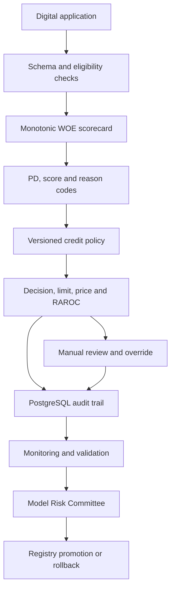
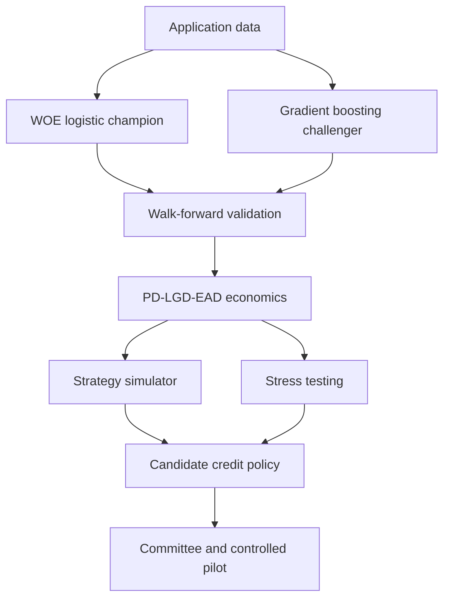
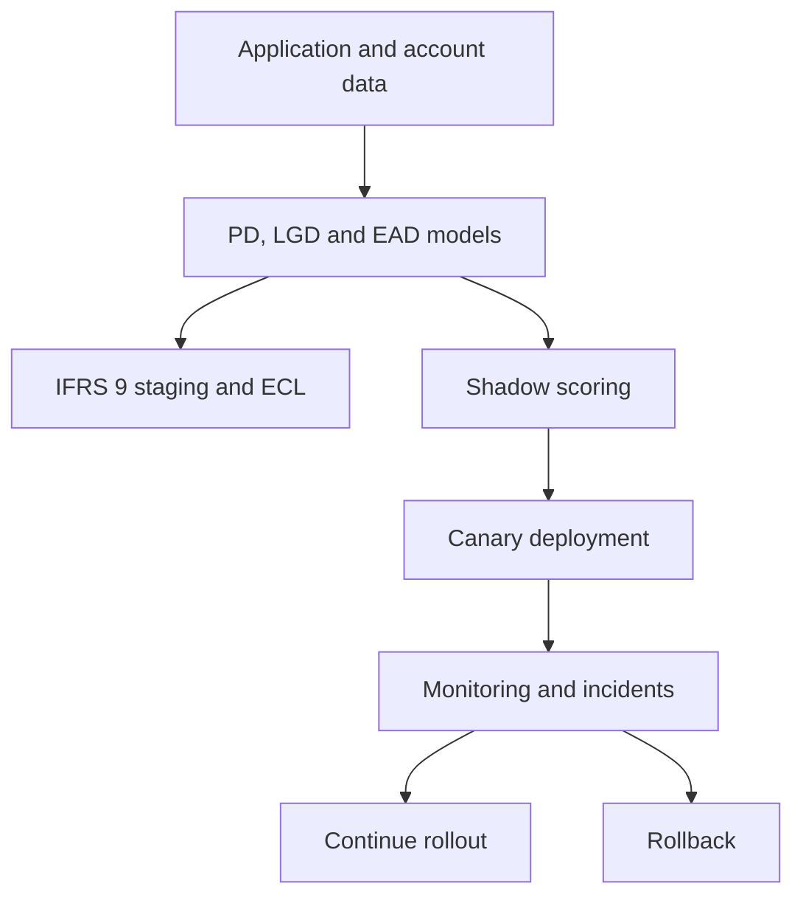

# Retail Credit Decisioning Platform V4.1

Model version and policy version are managed separately. Every decision stores an input snapshot, output snapshot, model ID, policy version, user identity and timestamp. Production deployment requires authentication, database connectivity, infrastructure security review and committee approval.

## Control boundaries

- Model Development owns code and evidence, not independent approval.
- Model Risk validates discrimination, calibration, stability, reconstruction and fairness.
- Credit Risk owns policy thresholds and delegated authority.
- Technology owns deployment, access, logging, resilience and rollback.
- Internal Audit receives read-only access to immutable decision records.
# V5 decision and profitability layer

The challenger requires at least 0.02 mean-AUC uplift before independent validation. V5 retains the WOE logistic champion because the synthetic walk-forward result does not meet this hurdle. The candidate policy remains separate from the active policy until validation and committee approval.

## V6 production and IFRS 9 architecture

Performance monitoring separates leading indicators from outcome-dependent measures. AUC, KS and calibration are not treated as available until the 12-month observation window matures. Deployment gates block further rollout when latency, error or decision-reconciliation thresholds fail.
